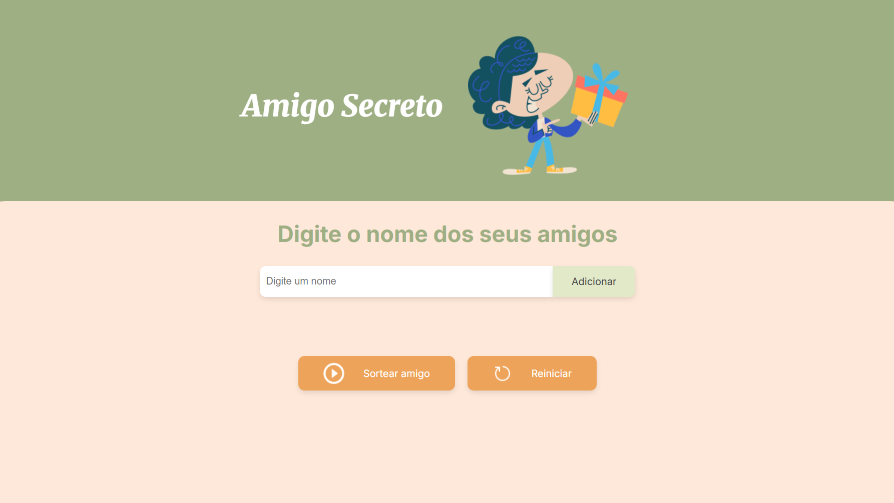

# 🎁 Amigo Secreto

Projeto desenvolvido durante o curso NextOne da **Alura + Oracle** para praticar **lógica de programação em JavaScript**.  
Implementei toda a lógica do jogo, e personalizei HTML e CSS para uma interface mais agradável e funcional.

---

## 💻 Tecnologias utilizadas
 
 
 

## 🌐 Acesse o site
Você pode acessar o jogo online aqui:  
[👉 Abrir Amigo Secreto](https://paulohassad.github.io/challenge_amigo_secreto_NextOne)  🎮

---

## 🚀 Como usar:

1. Digite os nomes dos amigos no campo de entrada e clique em **Adicionar**.
2. Clique em **Sortear amigo** para sortear aleatoriamente.
3. Clique em **Reiniciar** para limpar a lista e começar novamente.

---

---

## 📸 Imagem do projeto:

---

## ⚖️ Licença

MIT License
